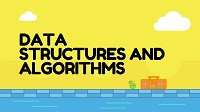

# Data-Structures-and-Algorithms(DSA)


[](./LICENSE)

This repository has all the practice codes of Data Structures and Algorithms done by me. Language of choice is C++.

Current development stage --> Tree, Bitmasking

```
g++ (GCC) 8.2.0
Copyright (C) 2018 Free Software Foundation, Inc.
This is free software; see the source for copying conditions.  There is NO
warranty; not even for MERCHANTABILITY or FITNESS FOR A PARTICULAR PURPOSE.

```

### Usage Instructions

#### Linux
```
g++ <filename>.cpp -o <filename>
./<filename>

```

#### Windows
```
g++ <filename>.cpp -o <filename>
<filename>.exe

```

# License

[The MIT License (MIT)](LICENSE)
